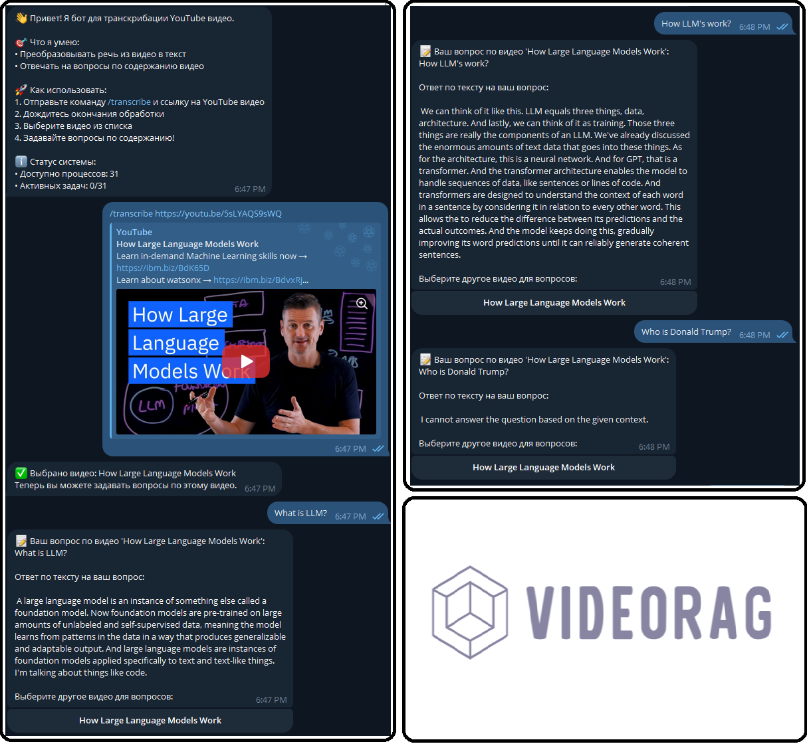

# VideoRAG - Чат-бот для ответов на вопросы по YouTube-видео

**VideoRAG** — это Telegram-бот, который позволяет пользователям загружать видео с YouTube, преобразовывать речь в текст и задавать вопросы по содержанию видео. Благодаря использованию современных моделей машинного обучения и обработки естественного языка, бот предоставляет точные ответы на основе контекста видео.

## 🚀 Основные возможности
- **Транскрибация видео**: загружает аудио из YouTube-видео и преобразовывает его в текст с помощью **Whisper**.
- **Ответы на вопросы**: находит релевантные фрагменты из транскрипта и отвечает на вопросы пользователя на основе контекста.
- **Многозадачность**: поддерживает параллельную обработку нескольких задач с использованием многопроцессорности.
- **Выбор видео**: позволяет пользователям выбирать обработанные видео для дальнейших вопросов.

---

## 🛠️ Технологии и библиотеки
- **Python** — язык программирования
- **aiogram** — асинхронный фреймворк для создания Telegram-ботов
- **yt-dlp** — инструмент для скачивания аудио из YouTube
- **Whisper** — модель от OpenAI для распознавания речи
- **LangChain** — для работы с текстовыми фрагментами и их семантическим поиском
- **HuggingFace Transformers** — модель LLM для генерации ответов
- **FAISS** — библиотека для поиска по векторным эмбеддингам
- **Sentence Transformers** — для генерации эмбеддингов текста

---

## 🧩 Установка и запуск

### 1. Установите зависимости
Для запуска проекта необходимо установить зависимости из `requirements.txt`:
```bash
pip install -r requirements.txt
```

### 2. Создайте окружение и настройте переменные
Установите токен вашего Telegram-бота как переменную окружения:
```bash
export TELEGRAM_BOT_TOKEN="YOUR_TELEGRAM_BOT_TOKEN"
```

### 3. Запустите бота
Запустите бота через Python:
```bash
python rag_youtube.py
```

---

## 🎮 Использование

1. **Запуск бота**
   - Напишите `/start` в чате с ботом, чтобы получить инструкции.

2. **Добавление видео**
   - Используйте команду `/transcribe <ссылка на YouTube>` для загрузки и транскрибации видео.

3. **Задавайте вопросы**
   - После успешной обработки видео, выберите его из списка и отправьте текстовый вопрос. Бот проанализирует транскрипт и предоставит ответ на основе контекста.

### Пример команд
- `/transcribe https://youtube.com/watch?v=example`
- Вопрос: "О чем говорилось в первой части видео?"

---

## ⚙️ Архитектура

1. **Загрузка видео**: yt-dlp скачивает аудио из YouTube.
2. **Транскрибация**: Whisper преобразует аудио в текст.
3. **Разделение на фрагменты**: LangChain разбивает текст на логические блоки для эффективного поиска.
4. **Семантический поиск**: FAISS и Sentence Transformers находят релевантный контекст для вопроса.
5. **Генерация ответа**: LLM на основе HuggingFace (мы остановились на gemma-2-9b-it) генерирует ответ на вопрос пользователя.

---

## 📋 Системные требования
- Python 3.9+
- CUDA для GPU (опционально для ускорения обработки)
- ffmpeg (для обработки аудио)

---

## 🔧 Конфигурация
Проект поддерживает следующие настройки через переменные окружения:
- `TELEGRAM_BOT_TOKEN` — токен Telegram-бота
- `MAX_WORKERS` — максимальное количество параллельных задач (по умолчанию: кол-во ядер CPU - 1)

---

## 🛡️ Безопасность
- **Токены и ключи**: Токен Telegram-бота не должен храниться в открытом виде.
- **Очистка временных файлов**: Аудиофайлы удаляются после обработки.

---

## 🤝 Вклад
Хочешь помочь улучшить проект? Вноси свой вклад!
1. Форкни репозиторий
2. Создай новую ветку (`git checkout -b feature/awesome-feature`)
3. Внеси изменения и закоммить (`git commit -m 'Add some feature'`)
4. Отправь PR (Pull Request)

---

## 📄 Лицензия
Этот проект распространяется под лицензией **MIT License**.

---

## 🚀 Авторы
- **Тишин Владислав** — [GitHub](https://github.com/Vloods)
- **Галимов Даниил** — [GitHub](https://github.com/GDaniil17)


## 🌟 Благодарности
- [OpenAI Whisper](https://github.com/openai/whisper)
- [HuggingFace](https://huggingface.co/)
- [yt-dlp](https://github.com/yt-dlp/yt-dlp)

---

## 📷 Скриншоты
Пример работы бота:

